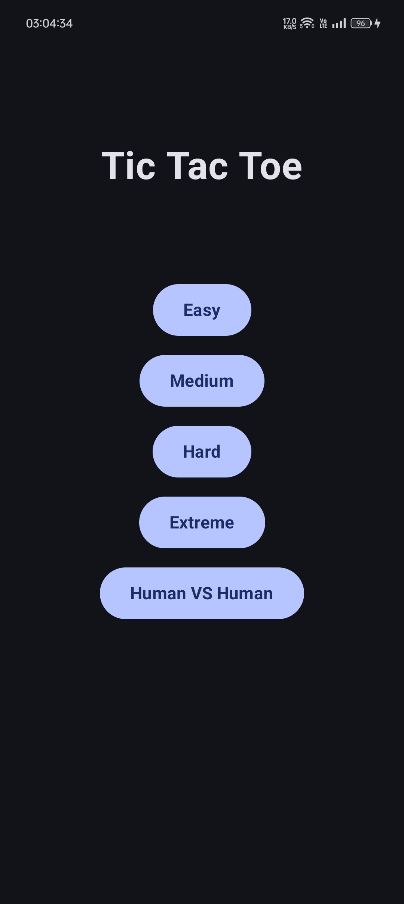
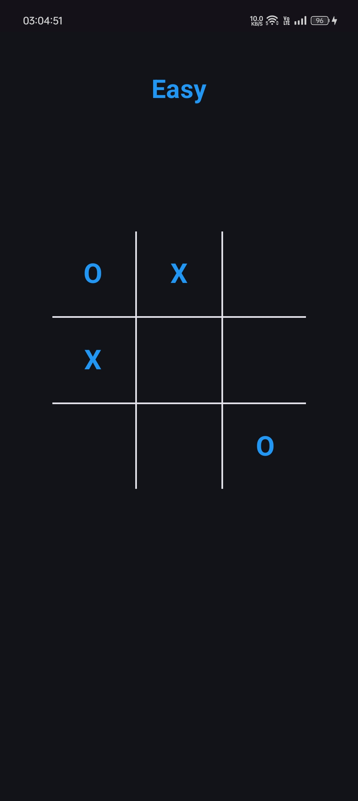

# Tic Tac Toe Game

Tic Tac Toe is a classic two-human game where players take turns marking a square in a 3x3 grid with their respective symbols (X and O). The objective is to be the first to form a horizontal, vertical, or diagonal line of three of your marks. This game includes both a human vs. human mode and a human vs. computer mode, utilizing various difficulty levels.

## Table of Contents
- [Features](#features)
- [Technologies Used](#technologies-used)
- [Screenshots](#screenshots)
- [How to Run the Project](#how-to-run-the-project)
- [Game Modes](#game-modes)
- [Difficulty Levels](#difficulty-levels)
- [Code Structure](#code-structure)
- [License](#license)
- [Author](#author)

## Features
- Human vs. Human mode.
- Human vs. Computer mode using varying difficulty levels.
- A simple and intuitive user interface.
- Supports both light and dark mode.

## Technologies Used
- **Programming Language:** Kotlin
- **Development Environment:** Android Studio (for Android development)
- **Other:** Jetpack Compose

## Screenshots
1. **Light Theme**  
<p align="center">
  
  
  
</p>

2. **Dark Theme**  
<p align="center">
  
  
  
</p>


## How to Run the Project
1. Clone the repository:
   ```bash
   git clone <repository-url>
   ```
2. Open the project in Android Studio.
3. Build and run the app on an Android device or emulator.

## Game Modes
### 1. Human vs. Human (HvH)
- In this mode, two humans take turns to play against each other on the same device.
- The game board displays the moves of both humans until one of them wins or the game ends in a draw.

### 2. Human vs. Computer (HvC)
- In this mode, one human competes against an computer opponent with four difficulty levels: Easy, Medium, Hard, and Extreme.

## Difficulty Levels
### Easy Mode
- The Computer randomly generates indices to make its moves.
- Suitable for beginners and casual players.

### Medium Mode
- The Computer blocks the human from winning by strategically placing its moves.
- This mode provides a moderate challenge.

### Hard Mode
- The Computer not only blocks the human but also looks for opportunities to win.
- It aims to secure victory whenever possible.

### Extreme Mode
- The Computer uses the minimax algorithm to evaluate all possible moves and select the best one.
- This mode offers the highest level of challenge, making it difficult for humans to win.

## Code Structure
The project consists of the following key components:
- **MainActivity.kt:** The Home Page for selecting game mode (Easy, Medium, Hard, Extreme, Human VS Human).
- **MainGameActivity.kt:** The main gane activity contains Tic Tac Toe interface and handles states.
- **SolverUtils.kt:** Contains the logic for implementing the difficulty levels, checking for winners and other utility functions.

## License
This project is licensed under the MIT License - see the [LICENSE](LICENSE) file for details.

## Author
Abhishek Rajput

